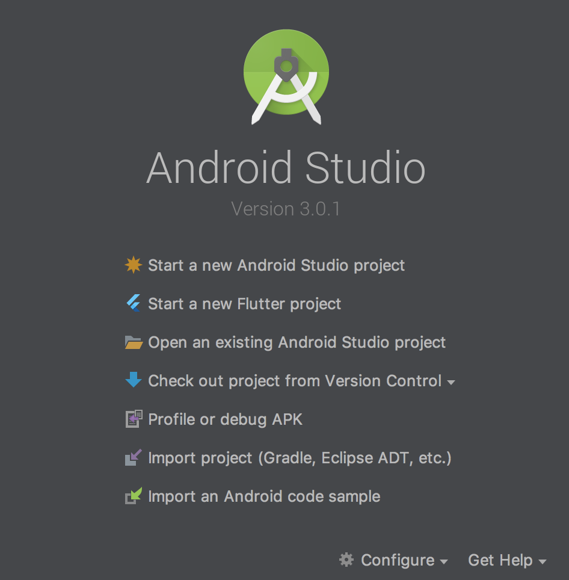
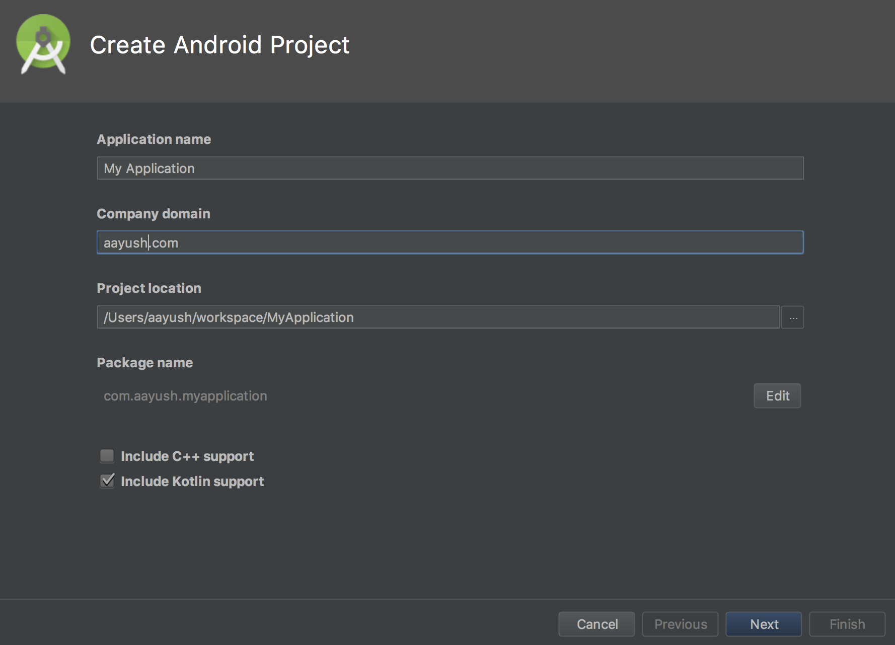
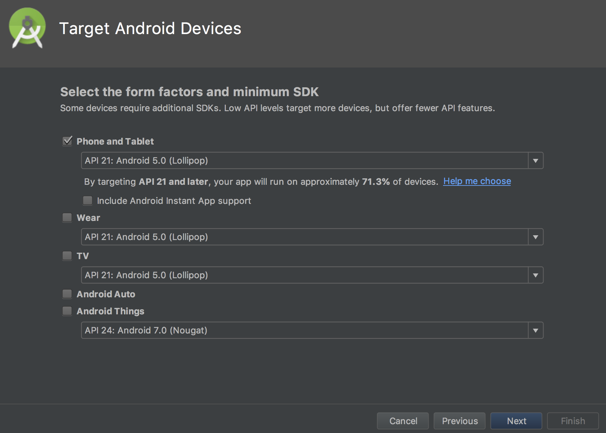
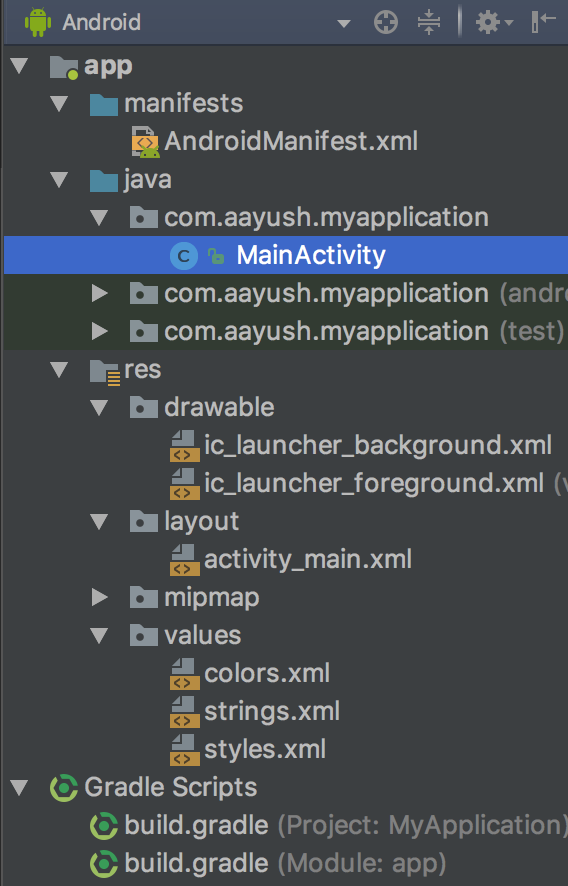

# Installing Android Studio
lol figure it out b

# Running your first app
Close any projects you might have open and you should arrive at this screen:





Click on Start a new Android Project and you should arrive here:



At this screen, you can name it anything you want, but pick a reasonable (and unique!) package name if you plan on launching the app to the app store. Make sure to deselect the "Kotlin support" checkbox if you're planning on following along in Java.

After this, you'll see another screen asking you to pick your minimum version of Android, and if you click "Help me choose" you'll see a distribution chart.


 

Choosing these is a bit up to you, since as the distribution screen will show you, newer versions of Android support more features that will make your life easier as a developer, but also support fewer devices. I would recommend 19 if you're looking to support the most people, 21 if you want a lot more features than 19 but not support everyone.

On the next "Add an Activity to Mobile" screen select "Empty Activity" and finish making the app. Try to run the app by clicking the play button up over here


The app will first have to build into something executable by your Android device (which is what the hammer represents), and will probably not be able to build initially since you have to install the Software Development Kit (SDK) depending on what version of Android you're targeting. Since there are so many different SDK versions you might want to run, Android Studio doesn't come preinstalled with any, so Android Studio won't know how to build the app. It's not difficult though, since everytime a build fails because a component is not installed, the error message will provide a prompt to install whatever you're missing and you can try again. Keep attempting to run the app until it successfully shows up.

If you don't have a device to run the default app on, the run screen will have a link to the Virtual Device manager, where you can create and use virtual devices. Once you have the default "Hello, world!" app running, you're ready to move on.

# Android File Structure
If you've created the project successfully, you'll be greeted with this file tree on the left (make sure you're viewing it in "Android" mode and not "Project" mode, as specified in the dropdown at the top.)



It might seem daunting at first, but you only have to worry about the directories expanded in the screenshot above!

## manifests
The manifest file defines the different activities (like screens) and broadcast receivers within your app and lets you decide which activity to label your MainActivity that you launch when the app first opens. You also add your permissions that you want to give to the app, like internet or storage.

## java/packagename
This is where you store all your Java / Kotlin code, and effectively where all the source code of the app goes. Currently, there should be one Java file here called MainActivity. To create an Activity, DO NOT create a Java file. You should right click the packagename folder, go to New, and select New Activity, since this will do extra stuff like create a default layout file and register it in the manifest.

## res
The `res` folder is where all visual resources and other assets are stored like layout files, images, audio, icons, strings, fonts, etc. The files in here are typically in XML, a language remniscient of HTML. Don't worry, it's not really a new language you have to learn! All the files are linked to Java using a special reference library called `R`.

The drawable folder is where images are stored. They recieve a unique id that can be referenced with `R.drawable.filename`, but it's also possible to reference them using a string value for the filename (although this involves receiving the above id, which is an integer value.) While you can just store plain old image files, custom xml files are supported as well, allowing for complex drawables (for example, a transparent cirsle that has a white ripple when pressed.)

The layout folder describes how all of our screens / parts of screens should be laid out. These can also be referenced by `R.layout.layoutname`, but are more deeply linked with their associated java files. To see what I mean, in MainActivity.java you can find the line
```java
setContentView(R.layout.activity_main);
```
and in activity_main.xml you can find the line
```xml
tools:context="packagename.MainActivity"
```

For the values folder, you shouldn't add files directly to this folder, but instead add to the existing files. Similar to the other folders, Strings in strings.xml can be referenced with `R.string.stringname` in Java and `@string/stringname` in XML. These files are used to be able to reference values that may change depend on who's using the app: for example, you might want user facing strings to be in a different language depending on the user's default language, and you might want dimensions to be different for tablets. It's good practice to save these values in their corresponding files regularly.

## gradle
Gradle is used to compile the app together and link together the Java and res folders. It also links together external libraries and APIs (including most of the core Android libraries!)

# Using Android Studio
There's several important features of Android Studio that need to be covered before we can get started writing any code. 

## General Shortcuts
These are shortcuts that can generally be used throughout the app. These shortcuts are for Macs, although I'm pretty sure they exist for Windows in similar combinations.

### ⌘ + Click
This will generally take you to the declaration of whatever you are clicking. This is useful if you're looking at a method or variable, and you're not sure where to find it to see what it does. If you're at the definition, this is also useful since it shows all the places where the method / variable is being referenced. 

### Alt + Enter
Many times, Android Studio will recognize that something is wrong, but will be reasonably confident that it knows how to fix it. For example, if a red variable is underlined in white (it needs to be imported), highlighted yellow (potentially causing bugs / is bad practice), grayed out (it's never used) then 

### Other useful things
- Refactor (rename all instances of) a variable with right click -> refactor -> rename
- ⌘ + \[ to go back to wherever your cursor was before
  - ⌘ + \] to move it forward
- ⌘ + O to search through Java files
- ⌘ + / to comment out with single line comment(s)
  - ⌘ + Shift + / to comment out with multiline comment
- ⌘ + F to search in file
  - ⌘ + Shift + F to search in all files
- ⌘ + R to find and replace in file
  - ⌘ + Shift + R to find and replace in all files

## Layouts
Layouts live in the `res` folder, and are written in XML. There is a visual editor as well, which is more convenient for editing your layouts when they are less complex.

### Views
Any component on your screen, like a block of text, button, image, input field, etc, are called Views. Views have common attributes like height, width, and background, which can be set by default in the layout file, or set while the app is running in the Java (this is called *programmatically* changing an attribute). Any View can also be clicked and have code executed when it is clicked.

### Different types of Layouts
While each layout is a single file, layouts also represent a general View to contain other Views, meaning my `activity_main.xml` for MainActivity has only one root ConstraintLayout, but that in turn could have LinearLayouts, FrameLayouts, etc within it. The basic layouts are
- **LinearLayout**: Display the Views in order, with attributes controlling the "weight". For example, if there are two Buttons with weight 1 and weight 2, and a vertical orientation, the first Button will take up 1/3 the height of the layout and the second will take up 2/3.
- **FrameLayout**: Wraps a single View. This is pretty common for workarounds, for example, I've used this before to wrap an input field that I want to be pressable, but not editable. Make the FrameLayout clickable, and the EditText unclickable.
- **ScrollView**: Wraps a single View, but allows it to scroll if it doesn't fit. Typically this single View is another layout to allow for more than one item.
- **ConstraintLayout**: Place Views relative to each other using attachments called "constraints". There are different types of constraints and a relatively complex system, but a versatile visual editor allows easy building of complex layouts.
- **RelativeLayout**: Relatively (hey gottem) outdated because of the newer and cleaner ConstraintLayout, but widely used in the industry. I honestly don't know how to use these, but you're probably not ever going to want to create a new RelativeLayout.
- **AbsoluteLayout**: A relic of prehistoric times. No idea what they're for since they were obsolete way before I learned Android. You can find them in museums, but don't touch the glass.

### Constraint Layout editor

### Asset Studio

## Java

## Other Tools

### Logcat

### Version Control


