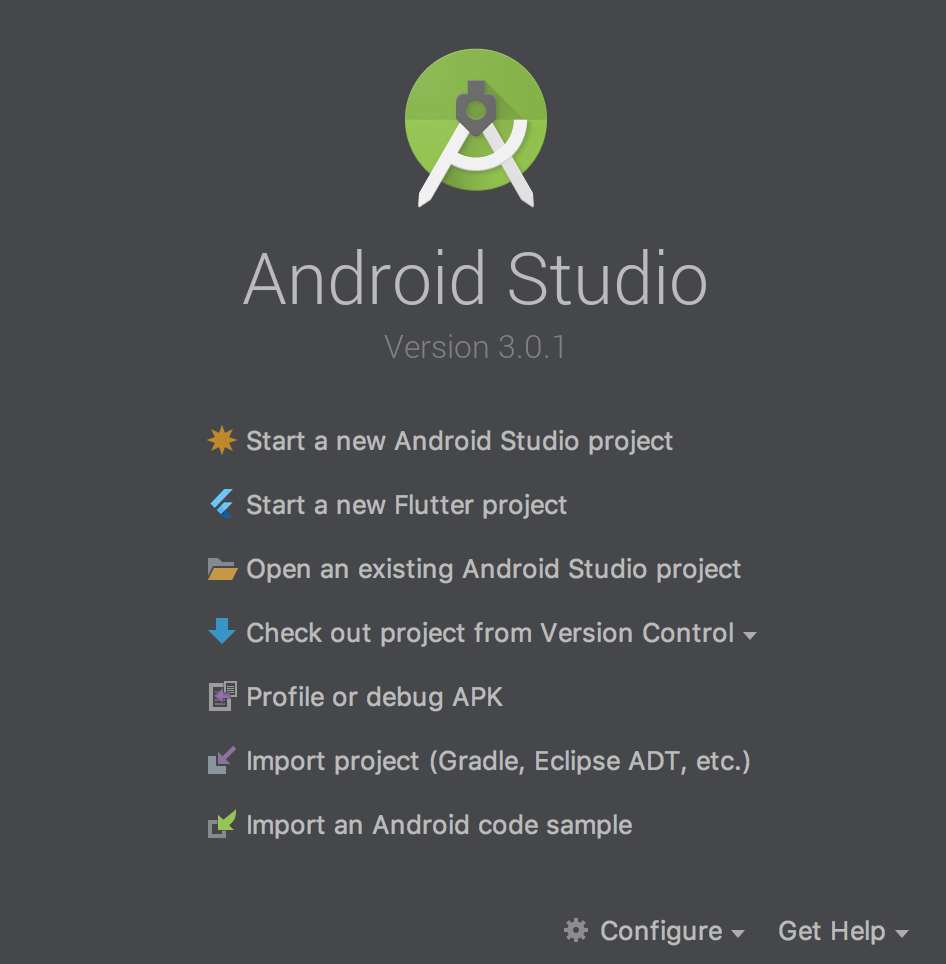
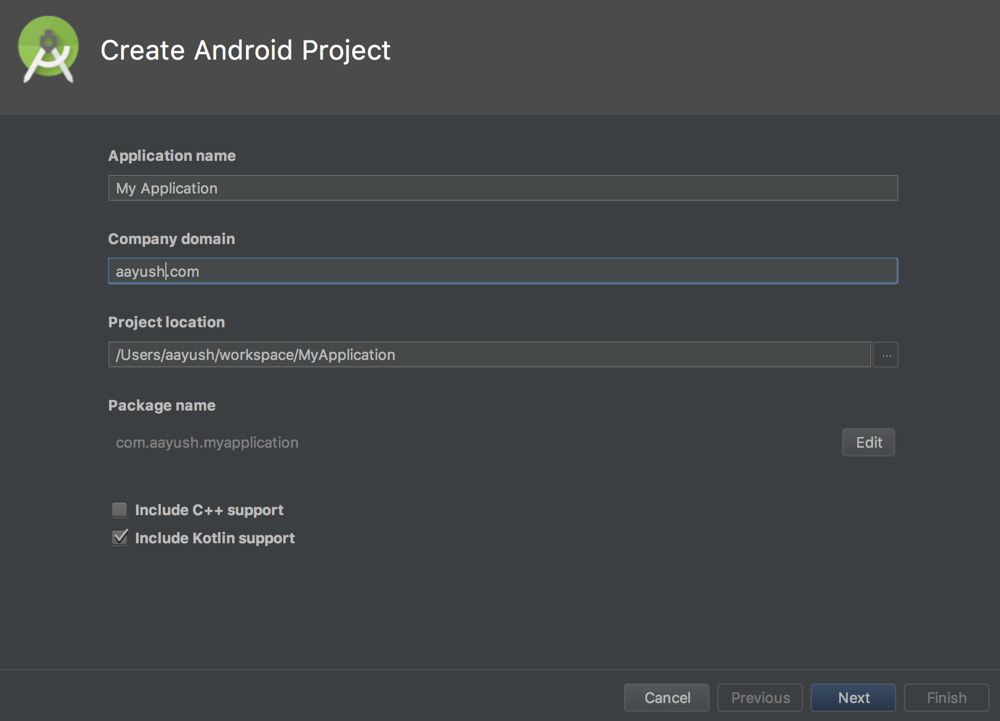
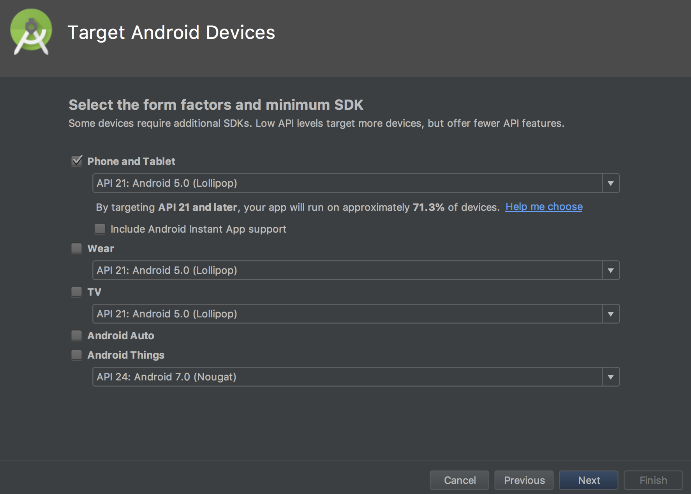
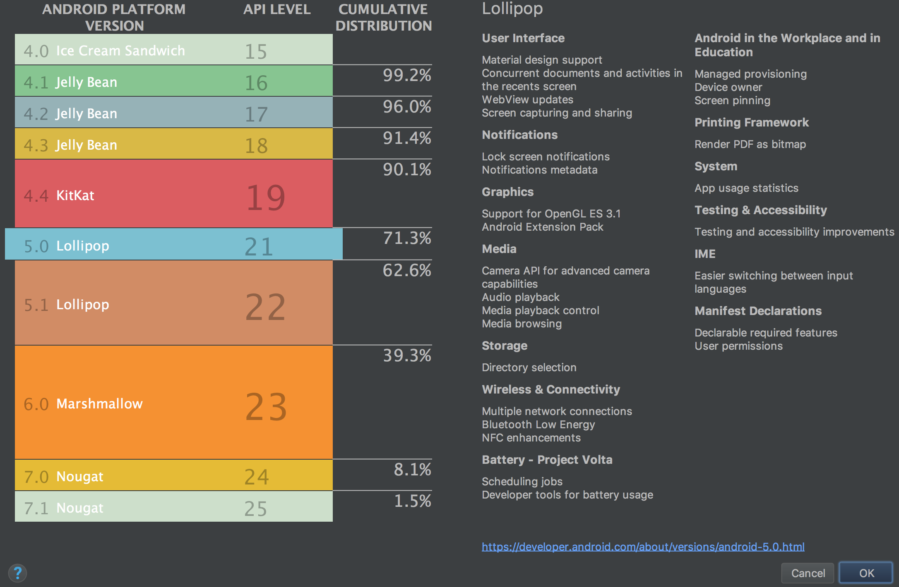
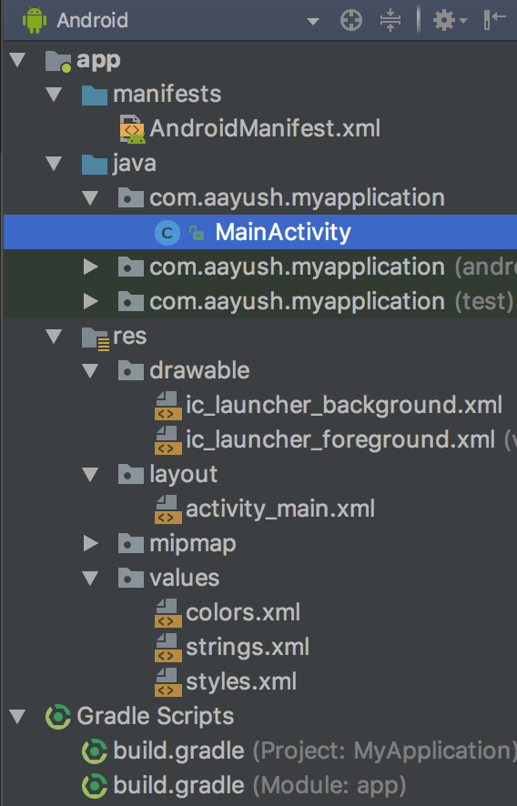

*Notes taken by Shreya Reddy and formatted by Aayush Tyagi*

# Java Review
In order to learn Android development, you'll need to know Java. Although we won't go over everything Java related, we'll go through a quick refresher.

## Data Types

### Declaring Variables

In Java, variables are declared by stating the type and then the name of the variable, and they are assigned with `=` and then the value you want to assign to it. Variables do not change types! For example,
```java
int yearInt = 2017;
String str = null;
float gpa = 4.20f;
String year = "2017";
year = yearInt; // does not compile, can't assign int to String
year = "2016";
char c;
c = 'a';
```

### Primitive Data Types
Primitive data types store raw data in a fixed amount of space, and are always lowercase in Java. Examples include
- `int` / `long` for integer values (Ex. `12` / `15L`)
- `float` / `double` for decimals (Ex. `4.20f` / `0.0`)
- `boolean`
- `char`
- other ones that are hardly used (`byte`, `short`)

Other non primitive data types are all children of the `Object` class, and do not directly store the values they represent (they store an address that points to the value.) As a result, using the `==` operator will usually not work, and values are instantiated to `null`, which doesn't point to anything. Attempting to invoke a method on a `null` value will raise a `NullPointerException`, or NPE.

## Methods

All functions belong to a class, so we call them methods. Methods must be called from an instance of a class unless they are specifically marked as `static`. Static methods must be called from the class itself (like `Math.round()`), and effectively do not belong to the object.

Example of a method in Java:
```java
class Adder {
    public static int addOne(int x) {
        return x + 1;
    }
}
...
Adder.addOne(3); // returns 4
```
## Loops
There are three types of loops in Java:
```java
for (int i = start; i < end; i += 1) {
    //do stuff
}
for (Object obj : objList) {
	//do stuff to obj
}
while (condition) {
	//do stuff
}
```

## Classes
Classes are a model for a new type of object that you want to work with. Classes can be children of other classes, and can be parents of others. All classes are children of the `Object` class and therefore have the methods `hashcode()` and `toString()`. Here is an example of a simple class:
```java
class Rectangle extends Shape {
	int width;
	int height;
	public Rectangle(...) {...}
	public int getWidth ...
	public int getHeight ...
	@Override
	public int getArea ...
}
```
### Objects
Objects are instances of the classes. While the above class is just an idea or template of a Rectangle, we can create a our own `Rectangle rect` with its own properties. 
```java
Rectangle rect = new Rectangle(3, 4);
rect.getArea(); // returns 12
```

### Anonymous Classes
Sometimes you want to extend an abstract class or interface for just a single object in Java (something very common in Android). These are called anonymous classes and have their own unique syntax.
```java
button.setOnClickListener(new View.OnClickListener() {
    @Override
    void onClick(View view) {
        // do stuff
    }
});
```

# Basic Git
## What is Git?
Git is a solution for version control - the idea that to prevent errors, development code should be kept separate from working code to prevent bugs. It also makes collaboration much easier in larger codebases. Despite its similarities to Google Drive, Git is not an offline storage solution, and should never be treated as one.

In version control, there is typically a master, prod, or release branch (a version of your codebase) that only contains ready to deploy features. You can branch off of this to add your own features or work on bugs, so that you can mess around while the working version of the app still exists and (more importantly) people can work on their own features in parallel.

Once you're done with your code and you think it's good to put (or *merge*) into master, you have two options:
1. Push your code to master - you may get a merge conflict which you have to manually resolve, but Git can handle minor changes.
2. Make a pull request - ask for someone to review it and when everyone's good to go, you or someone else with write access can merge it in.

Git also allows you to manage versions on a single branch too, every time you push something to Github, it's stored as a diff, only remembering the changes you made from the last version (or *commit*). You can revert to any commit at any time, a useful feature if you make a mistake.

## Github
Serves as a remote location for your git "repository". You can add collaborators, write a wiki, check branches, and manage pull requests from here. Typically employers will check your Github, so it's good to have your projects on Github even if you're working solo and don't need version control. It's not a Google Drive alternative so you shouldn't (though you can) edit code on Github.

## Common Commands
- `git init`
  - Enables git commands in the current directory and all subdirectories
- `git remote add origin https://github.com/...`
  - Adds a remote location for your code called "origin" linking to the given URL. Doesn't actually interact with it here.
- `git clone (-b branchName) https://github.com/...`
  - Clones the code at the URL's master branch. To clone a specific branch, use the -b
- `git checkout (-b) branchName`
  - Creates and enters a new branch with your current changes with name "branchName". If the branch already exists, ignore the -b
- `git add -A`
  - Saves the state of your code and makes it ready to commit
- `git commit -m "first commit"`
  - Commits the changes with message "first commit." Commits are accessible even when more are pushed on top, so use useful messages.
- `git push origin branchName`
  - Pushes the commit to the specific remote at the specific branch. Push often to your branch to avoid losing code! You can also push to master, though it's better to make a pull request through Github.
- `git pull origin master`
  - Pulls the code from master into your current code. If you're working on a feature that someone else has edited, you will have to pull and resolve any conflicts to get that code. 

# Intro to Android
This part will be more of a walkthrough, and we assume that you already have the latest version of Android Studio up and running. Make sure that you're able to run the demo app - a lot of times errors will pop up prompting you to install things, but they provide links for you to do so. If you run into anything unexpected, Google and StackOverflow are your friends!


## Creating your first app
Close any projects you might have open and you should arrive at this screen:





Click on Start a new Android Project and you should arrive here:



At this screen, you can name it anything you want, but pick a reasonable (and unique!) package name if you plan on launching the app to the app store. Make sure to deselect the "Kotlin support" checkbox if you're planning on following along in Java.

After this, you'll see another screen asking you to pick your minimum version of Android, and if you click "Help me choose" you'll see a distribution chart.


 

Choosing these is a bit up to you, since as the distribution screen will show you, newer versions of Android support more features that will make your life easier as a developer, but also support fewer devices. I would recommend 19 if you're looking to support the most people, 21 if you want a lot more features than 19 but not support everyone.

On the next "Add an Activity to Mobile" screen select "Empty Activity" and finish making the app. Try to run the app by clicking the play button up over here


The app will first have to build into something executable by your Android device (which is what the hammer represents), and will probably not be able to build initially since you have to install the Software Development Kit (SDK) depending on what version of Android you're targeting. Essentially, if something is blue in your error log and prompts you to install something, just do what it says!

If you don't have a device to run the default app on, the run screen will have a link to the Virtual Device manager, where you can create and use virtual devices. Once you have the default "Hello, world!" app running, you're ready to move on.

## Android File Structure
If you've created the project successfully, you'll be greeted with this file tree on the left (make sure you're viewing it in "Android" mode and not "Project" mode, as specified in the dropdown at the top.)



It might seem daunting at first, but you only have to worry about the directories expanded in the screenshot above!

### manifests
The manifest file defines the different activities (like screens) and broadcast receivers within your app and lets you decide which activity to label your MainActivity that you launch when the app first opens. You also add your permissions that you want to give to the app, like internet or storage.

### java/packagename
This is where you store all your Java / Kotlin code, and effectively where all the source code of the app goes. Currently, there should be one Java file here called MainActivity. To create an Activity, DO NOT create a Java file. You should right click the packagename folder, go to New, and select New Activity, since this will do extra stuff like create a default layout file and register it in the manifest.

### res
The `res` folder is where all visual resources and other assets are stored like layout files, images, audio, icons, strings, fonts, etc. The files in here are typically in XML, a language remniscient of HTML. Don't worry, it's not really a new language you have to learn! All the files are linked to Java using a special reference library called `R`.

The drawable folder is where images are stored. They recieve a unique id that can be referenced with `R.drawable.filename`, but it's also possible to reference them using a string value for the filename (although this involves receiving the above id, which is an integer value.) To add some default icons, right click the drawable folder

The layout folder describes how all of our screens / parts of screens should be laid out. These can also be referenced by `R.layout.layoutname`, but are more deeply linked with their associated java files. To see what I mean, in MainActivity.java you can find the line
```java
setContentView(R.layout.activity_main);
```
and in activity_main.xml you can find the line
```xml
tools:context="packagename.MainActivity"
```

For the values folder, you shouldn't add files directly to this folder, but instead add to the existing files. Similar to the other folders, Strings in strings.xml can be referenced with `R.string.stringname` in Java and `@string/stringname` in XML. These files are used to be able to reference values that may change depend on who's using the app: for example, you might want user facing strings to be in a different language depending on the user's default language, and you might want dimensions to be different for tablets. It's good practice to save these values in their corresponding files regularly.

### gradle
Gradle is used to compile the app together and link together the Java and res folders. It also links together external libraries and APIs (including most of the core Android libraries!)

## Using Android Studio
There's several important features of Android Studio that need to be covered before we can get started writing any code. 

### General Shortcuts

#### Common Keyboard shortcuts

#### Ctrl + Click

#### Alt + Enter

### Layout Stuff

#### Asset Studio

#### Constraint Layout editor

### Java Stuff

### Other Tools

#### Logcat

#### Version Control

Views:
A view is an abstract class representing an item the user can see on the screen, like a regular text field, button, image, switch, etc. Views have properties like text and color.
Some Views are containers for other Views, like a dropdown menu or a scrolling list.
In Android Studio, editing any layout file will show common Views on the left of the visual editor.
Ex. TextView, ImageView, RecyclerView, CardView, FloatingActionButton

Programmatically Updating Views:
View v = findViewById(R.id.viewId);
v.setOnClickListener(new OnClickListener() {//autofill});
((TextView) findViewById(R.id.text)).setText("Hello");

Layouts:
A specific View that defines how the Views contained will be arranged
ConstraintLayout
The standard layout for all uses. Views are constrained to each other in a variety of ways to allow for dynamic and sensible layouts
"RelativeLayout" is an outdated version of this
LinearLayout
All Views are organized either horizontally or vertically. Nice and simple, with the added functionality of evenly spacing the Views to fill up the space
GridLayout
CoordinatorLayout

Layout Files:
Layout files are XML files that describe how Views will be initialized. It is possible to create them in the Java files, but typically the layout files are in the res folder.
Android Studio has a handy visual editor that lets you add Views to your layout file and edit their starting properties, but sometimes it's faster to edit in the XML.

Activities:
For now, you can think of an activity as essentially one screen in Android (this gets more inaccurate the more you learn about Android), and typically corresponds to one layout file. This is where we handle the logic for the screen. 
In addition to what happens while you're in this Activity, there are also several methods called at different points in the lifecycle.

Activity Lifecycle:
Note that when an Activity starts, onCreate(), onStart(), and onResume() are all called before it starts running.
<Insert graphic>

Intents:
Intents represent actions that can leave the Activity and do something else. With an Intent, you can do many things, such as
- Open a new Activity (in your app or another)
  - Before executing the Intent, you can add data, or "extras" to it
- Open an Activity, get data, and return to your Activity
  - For example, to take a picture
- Start background services or broadcast data

Contexts:
A context is usually passed into a method that needs to know what the current Activity is, like an Intent.
Every Activity is a Context, so if you're defining a method within an Activity and need the Context, you can just use the keyword this.
If you're within an anonymous class / object, "ActivityName.this" will be needed to clarify which class it refers to.

Intent Methods:
Intent i = new Intent(this, OtherActivity.class);
i.putExtra("age", 5);
startActivity(i); //also startActivityForResult
int weight = getIntent().getExtras().getInt("age");
